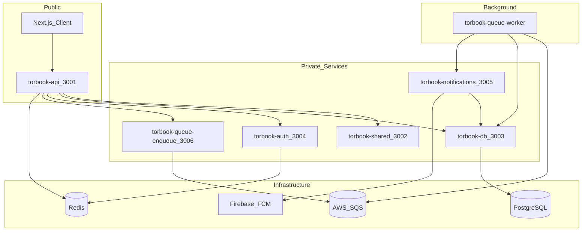

# TorBook Backend — Deployment Guide

Master reference for local development and Render deployment. Authoritative config lives in [`render.yaml`](../render.yaml) and [`docker-compose.yml`](../docker-compose.yml).

## Architecture



**Key rule:** Only `torbook-api` is public. All other HTTP services require `X-Internal-Key: <INTERNAL_SERVICE_SECRET>` on every request (see `@torbook/shared/server/internal-auth`).

### Service and port table

| Render service | Package | Type | Port | Plan |
|----------------|---------|------|------|------|
| `torbook-api` | `@torbook/api` | web (public) | 3001 | free |
| `torbook-shared` | `@torbook/shared` | pserv | 3002 | starter |
| `torbook-db` | `@torbook/db` | pserv | 3003 | starter |
| `torbook-auth` | `@torbook/auth` | pserv | 3004 | starter |
| `torbook-notifications` | `@torbook/notifications` | pserv | 3005 | starter |
| `torbook-queue-enqueue` | `@torbook/queue` | pserv | 3006 | starter |
| `torbook-queue-worker` | `@torbook/queue` | worker | — | starter |

Private services and workers use Render's `starter` plan (~$7/month each). Only the public API web service can use the free tier.

---

## Local development

### Option A — Infrastructure only

Start Postgres and Redis, run services on the host:

```bash
cp .env.example .env   # edit secrets as needed
pnpm docker:infra      # postgres on :5433, redis on :6379
pnpm db:migrate        # apply schema
pnpm dev               # starts api on :3001 (other services must be running separately)
```

Individual package dev scripts are available under each `packages/*/package.json`.

### Option B — Full Docker stack

```bash
cp .env.example .env
pnpm docker:up         # profile `app` — builds and starts all services
```

Docker Compose overrides service URLs and database/redis connections for container networking. See [`docker-compose.yml`](../docker-compose.yml) for wiring. API is exposed on `http://localhost:3001`.

### Environment file

Copy [`.env.example`](../.env.example) to `.env`. Never commit `.env`. Placeholder values are documented there for every secret.

---

## Render deployment

### Blueprint setup

1. Render Dashboard → **Blueprints** → **New Blueprint Instance**
2. Connect your repo and set **Root Directory** to `backend`
3. Render reads [`render.yaml`](../render.yaml) and creates all seven services
4. Fill in secrets marked `sync: false` in the Dashboard (see matrix below)
5. Set `CORS_ORIGIN` on `torbook-api` to your frontend origin (e.g. `https://torbook122.github.io`)

Service URLs (`SHARED_SERVICE_URL`, `DB_SERVICE_URL`, etc.) are wired automatically via `fromService: hostport`. The code adds `http://` when the value lacks a scheme.

### Build and start behavior

- **torbook-db** runs `prisma migrate deploy` on every container start before the app boots
- **torbook-queue-enqueue** serves HTTP at port 3006
- **torbook-queue-worker** has no HTTP — it polls SQS in the background

---

## Secrets matrix

Use the **same** `INTERNAL_SERVICE_SECRET` value on every service.

| Render service | Required secrets (`sync: false`) | Auto-wired env vars |
|----------------|----------------------------------|---------------------|
| `torbook-api` | `INTERNAL_SERVICE_SECRET`, `REDIS_URL`, `CORS_ORIGIN` | `SHARED_SERVICE_URL`, `DB_SERVICE_URL`, `AUTH_SERVICE_URL`, `QUEUE_SERVICE_URL` |
| `torbook-shared` | `INTERNAL_SERVICE_SECRET`, `AES_ENCRYPTION_KEY` | — |
| `torbook-db` | `INTERNAL_SERVICE_SECRET`, `DATABASE_URL` | — |
| `torbook-auth` | `INTERNAL_SERVICE_SECRET`, `REDIS_URL`, `JWT_ACCESS_SECRET`, `JWT_REFRESH_SECRET` | — |
| `torbook-notifications` | `INTERNAL_SERVICE_SECRET`, `FCM_SERVICE_ACCOUNT_JSON` | `DB_SERVICE_URL` |
| `torbook-queue-enqueue` | `INTERNAL_SERVICE_SECRET`, `AWS_REGION`, `AWS_SQS_QUEUE_URL` | — |
| `torbook-queue-worker` | `INTERNAL_SERVICE_SECRET`, `AWS_REGION`, `AWS_SQS_QUEUE_URL` | `DB_SERVICE_URL`, `NOTIFICATIONS_SERVICE_URL` |

### Generating secrets

| Secret | How to generate |
|--------|-----------------|
| `INTERNAL_SERVICE_SECRET` | Any strong random string |
| `JWT_ACCESS_SECRET` / `JWT_REFRESH_SECRET` | `openssl rand -hex 32` |
| `AES_ENCRYPTION_KEY` | 64 hex characters (32 bytes) |
| `DATABASE_URL` | Render managed Postgres connection string |
| `REDIS_URL` | Render Key Value or external Redis URL |
| `FCM_SERVICE_ACCOUNT_JSON` | Firebase service account JSON as a single-line string |
| `AWS_SQS_QUEUE_URL` | AWS SQS queue URL in the configured region |

---

## Boot order

When bringing up a fresh environment, start or verify services in this order:

1. **PostgreSQL** — managed database or local `docker:infra`
2. **Migrations** — `pnpm db:migrate` locally, or automatic on `torbook-db` start in Render
3. **torbook-db** — data layer must be up before services that query it
4. **torbook-shared** — PII crypto used by api and db flows
5. **torbook-auth** — requires Redis
6. **torbook-notifications** — requires db for FCM token lookup
7. **torbook-queue-enqueue** — job submission endpoint
8. **torbook-queue-worker** — background job processor
9. **torbook-api** — public gateway (depends on all of the above)

---

## Frontend configuration

Set the Next.js client API URL to the public Render host:

```
NEXT_PUBLIC_API_URL=https://<torbook-api-host>/api/v1
```

For GitHub Pages deployments, configure this as a GitHub Actions variable or environment secret.

---

## Verify deployment

1. **Health check:** `GET https://<torbook-api-host>/health` returns `{ "success": true, "data": { "status": "ok" } }`
2. **Startup logs:** `TorBook API listening on port 3001` with no missing-env-var errors
3. **Auth smoke test:** Login with wrong credentials returns **401** (not 500)
4. **Internal services:** Each private service exposes `/health` (reachable only on Render's internal network)

---

## Troubleshooting

### "SHARED_SERVICE_URL is required" (or similar)

The API **cannot run alone**. It needs private services deployed and their URLs configured. With the Blueprint, `fromService: hostport` handles this automatically. If deploying manually, set all four service URLs on `torbook-api`:

```
SHARED_SERVICE_URL=http://<internal-address-of-shared>
DB_SERVICE_URL=http://<internal-address-of-db>
AUTH_SERVICE_URL=http://<internal-address-of-auth>
QUEUE_SERVICE_URL=http://<internal-address-of-queue-enqueue>
```

Copy internal addresses from each private service → **Connect** → **Internal** in the Render Dashboard.

### Missing or mismatched secrets

- Every service must have `INTERNAL_SERVICE_SECRET` set to the **same value**
- `torbook-auth` exits on startup if Redis is unreachable — verify `REDIS_URL`
- `torbook-db` returns 503 on `/health` if `DATABASE_URL` is wrong or Postgres is down

### CORS errors from the frontend

- `CORS_ORIGIN` on `torbook-api` must match the frontend origin exactly (scheme + host, no path suffix)
- Multiple origins are comma-separated: `https://torbook122.github.io,http://localhost:3000`
- The `/admin` panel is same-origin HTML and does not use CORS

### Queue not processing jobs

- Verify `AWS_SQS_QUEUE_URL` and `AWS_REGION` are set on both enqueue and worker services
- Locally, an empty URL or placeholder account ID (`000000000000`) enables log-only mode — jobs are logged but not sent to SQS
- The worker does not start polling in log-only mode

### Login returns 500 instead of 401

Usually means a downstream private service is unreachable or misconfigured. Check `torbook-api` logs and verify all four service URLs and `INTERNAL_SERVICE_SECRET` match across services.

---

## Service documentation

Per-package guides with endpoints, env vars, and change guidelines:

- [`services/api.md`](services/api.md)
- [`services/shared.md`](services/shared.md)
- [`services/db.md`](services/db.md)
- [`services/auth.md`](services/auth.md)
- [`services/notifications.md`](services/notifications.md)
- [`services/queue.md`](services/queue.md)
