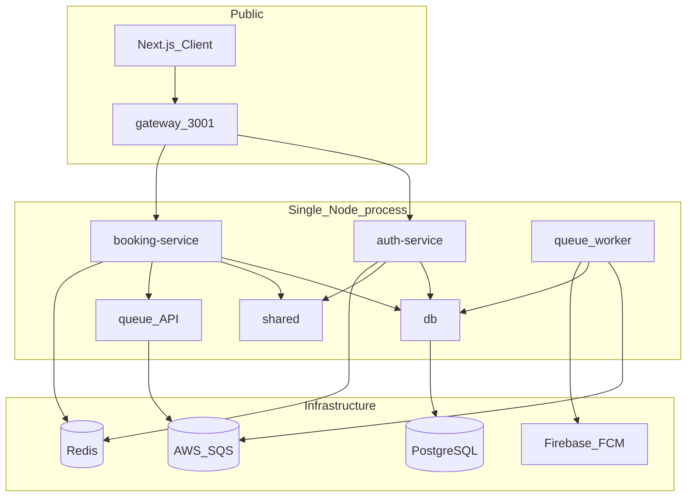

# KvaTor Backend — Deployment Guide

Master reference for local development and Render deployment. Authoritative config lives in [`render.yaml`](../render.yaml) and [`docker-compose.yml`](../docker-compose.yml).

## Architecture

Production runs all backend modules in a **single Docker container** (`@torbook/monolith`). The gateway is the only public HTTP listener; internal modules communicate over loopback.



**Key rule:** Only the gateway port is public. Internal HTTP calls use `X-Internal-Key: <INTERNAL_SERVICE_SECRET>` (see `@torbook/shared/server/internal-auth`).

### Module and port table (loopback, dev/Docker)

| Package | Port | Role |
|---------|------|------|
| `@torbook/gateway` | 3001 | Public gateway (only exposed port) |
| `@torbook/auth-service` | 3002 | Auth and user routes |
| `@torbook/booking-service` | 3003 | Businesses, appointments, favorites |
| `@torbook/queue` | 3004 | Job enqueue API |
| `@torbook/db` | 3010 | Prisma data layer |
| `@torbook/shared` | 3011 | PII crypto |

The SQS worker runs in the same process with no HTTP port.

---

## Local development

### Option A — Infrastructure only

Start Postgres and Redis, run services on the host:

```bash
cp .env.example .env   # edit secrets as needed
pnpm docker:infra      # postgres on :5433, redis on :6379
pnpm db:migrate        # apply schema
pnpm dev:all           # all 6 modules via tsx watch (gateway on :3001)
```

### Option B — Full Docker stack

```bash
cp .env.example .env
pnpm docker:up         # postgres + redis + unified app container
```

Docker Compose runs `postgres`, `redis`, and a single `app` container (3 long-running containers). The `app` container runs `prisma migrate deploy` on startup before launching all modules. API is exposed on `http://localhost:3001`.

### Environment file

Copy [`.env.example`](../.env.example) to `.env`. Never commit `.env`. Placeholder values are documented there for every secret.

---

## Render deployment

### Blueprint setup

1. Render Dashboard → **Blueprints** → **New Blueprint Instance**
2. Connect your repo and set **Root Directory** to `backend`
3. Render reads [`render.yaml`](../render.yaml) and creates one web service: **`torbook`**
4. Fill in all secrets marked `sync: false` in the Dashboard (see matrix below)
5. Set `CORS_ORIGIN` to your frontend origin (e.g. `https://torbook122.github.io`)

No inter-service URL wiring is needed — the monolith sets loopback URLs automatically at startup.

### Build and start behavior

- **Dockerfile:** [`Dockerfile`](../Dockerfile) at the backend root
- **Build:** `pnpm install`, `prisma generate`, `pnpm -r run build`
- **Start:** `prisma migrate deploy` then `node packages/monolith/dist/index.js`
- **Health check:** `GET /health` on the public port

The same `Dockerfile` works on Railway and other Docker hosts without changes.

---

## Secrets matrix

All secrets are set on the single `torbook` service:

| Variable | Required | Notes |
|----------|----------|-------|
| `INTERNAL_SERVICE_SECRET` | yes | Same value used for all internal HTTP calls |
| `DATABASE_URL` | yes | Render managed Postgres connection string |
| `REDIS_URL` | yes | Render Key Value or external Redis URL |
| `JWT_ACCESS_SECRET` | yes | `openssl rand -hex 32` |
| `JWT_REFRESH_SECRET` | yes | `openssl rand -hex 32` |
| `AES_ENCRYPTION_KEY` | yes | 64 hex characters (32 bytes) |
| `CORS_ORIGIN` | yes | Comma-separated frontend origins (no path suffix). Invite links use the first non-localhost origin; `*.github.io` gets `/frontend` appended. |
| `AWS_REGION` | yes | SQS region |
| `AWS_SQS_QUEUE_URL` | yes | Empty or placeholder enables log-only mode |
| `FCM_SERVICE_ACCOUNT_JSON` | yes | Firebase service account as single-line JSON |
| `ADMIN_USERNAME` / `ADMIN_PASSWORD` | no | Admin panel credentials |

### Generating secrets

| Secret | How to generate |
|--------|-----------------|
| `INTERNAL_SERVICE_SECRET` | Any strong random string |
| `JWT_ACCESS_SECRET` / `JWT_REFRESH_SECRET` | `openssl rand -hex 32` |
| `AES_ENCRYPTION_KEY` | 64 hex characters (32 bytes) |
| `FCM_SERVICE_ACCOUNT_JSON` | Firebase service account JSON as a single-line string |

---

## Boot order

When bringing up a fresh environment:

1. **PostgreSQL** — managed database or local `docker:infra`
2. **Migrations** — `pnpm db:migrate` locally, or automatic `prisma migrate deploy` on container start in production
3. **Monolith** — starts internal modules on loopback, then gateway on `PORT`

---

## Frontend configuration

Set the Next.js client API URL to the public Render host:

```
NEXT_PUBLIC_API_URL=https://<torbook-host>/api/v1
```

For GitHub Pages deployments, configure this as a GitHub Actions variable or environment secret.

---

## Verify deployment

1. **Health check:** `GET https://<torbook-host>/health` returns `{ "success": true, "data": { "status": "ok" } }`
2. **Startup logs:** `KvaTor monolith ready on port …` with no missing-env-var errors
3. **Auth smoke test:** Login with wrong credentials returns **401** (not 500)

---

## Troubleshooting

### Missing required environment variables

The monolith validates gateway env vars at startup (`SHARED_SERVICE_URL`, `DB_SERVICE_URL`, `AUTH_SERVICE_URL`, etc.). These are set automatically on loopback — if validation fails, check that `NODE_ENV=production` and required secrets (`REDIS_URL`, `CORS_ORIGIN`, `INTERNAL_SERVICE_SECRET`) are present.

### Missing or mismatched secrets

- `INTERNAL_SERVICE_SECRET` must be set
- Auth flows require a reachable `REDIS_URL`
- `db` returns 503 on `/health` if `DATABASE_URL` is wrong or Postgres is down

### CORS errors from the frontend

- `CORS_ORIGIN` must match the frontend origin exactly (scheme + host, no path suffix)
- Multiple origins are comma-separated: `https://torbook122.github.io,http://localhost:3000`
- The `/admin` panel is same-origin HTML and does not use CORS

### Queue not processing jobs

- Verify `AWS_SQS_QUEUE_URL` and `AWS_REGION` are set
- Locally, an empty URL or placeholder account ID (`000000000000`) enables log-only mode — jobs are logged but not sent to SQS
- The worker does not start polling in log-only mode

### Login returns 500 instead of 401

Usually means an internal module failed to start or a secret is missing. Check container logs for errors during monolith startup.

---

## Service documentation

Per-module guides with endpoints, env vars, and change guidelines:

- [`services/gateway.md`](services/gateway.md)
- [`services/shared.md`](services/shared.md)
- [`services/db.md`](services/db.md)
- [`services/auth-service.md`](services/auth-service.md)
- [`services/booking-service.md`](services/booking-service.md)
- [`services/queue.md`](services/queue.md)

Legacy docs (not active in deploy): [`services/api.md`](services/api.md), [`services/auth.md`](services/auth.md), [`services/notifications.md`](services/notifications.md).
