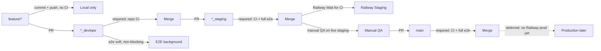

# Git workflow — develop → staging → main

Cross-repo git flow for KvaTor. Backend and frontend are separate GitHub repos with paired branch names. Only **Railway Staging** auto-deploys in this phase; production Railway deploy from `main` is deferred.

## Branch flow

### Branch names

| Repo | Develop | Staging | Production (git line) |
|------|---------|---------|------------------------|
| Backend | `backend_devlope` | `backend_staging` | `main` |
| Frontend | `frontend_devlope` | `frontend_staging` | `main` |

Spelling stays **`devlope`** (not `develop`). Feature branches (`feature/*`) are not CI-gated on push.

## CI rules by gate

| Gate | Trigger | Backend / frontend CI | E2E |
|------|---------|----------------------|-----|
| Feature push | `feature/*` | none | none |
| PR → `*_devlope` | PR into develop | **required** | runs as **`e2e-soft`**, does **not** block merge |
| PR → `*_staging` | PR develop → staging | **required** | **required** (`e2e`) |
| PR → `main` | PR staging → main | **required** | **required** (`e2e`) |
| Push to `*_staging` | after merge | CI green → Railway Staging deploy | — |

Workflow locations (this repo):

- CI: [`.github/workflows/ci.yml`](../.github/workflows/ci.yml)
- E2E: [`.github/workflows/e2e.yml`](../.github/workflows/e2e.yml)
- Frontend mirror: `TorBook122/frontend` → `.github/workflows/e2e.yml`

## Day-to-day developer path

1. `git checkout -b feature/my-change` from latest `*_devlope`
2. Commit + push — no CI on feature branches
3. Open PR → `*_devlope` — wait for repo CI; e2e-soft may fail without blocking
4. Open PR `*_devlope` → `*_staging` — full CI + e2e must pass → Railway Staging deploys after Wait for CI
5. Manual QA on live staging
6. Open PR `*_staging` → `main` — full CI + e2e again (git production line; no Railway prod deploy yet)

## PR checklist

Before merging to `*_staging`:

- [ ] Repo CI (`ci`) green
- [ ] E2E (`e2e`) green
- [ ] Paired repo branch is in sync if the change is cross-cutting (API + UI)
- [ ] Enum sync passes on frontend if backend enums changed

Before merging to `main`:

- [ ] Staging QA completed on Railway Staging URLs
- [ ] CI + e2e green on both repos (if both changed)

---

## Manual dashboard checklist

These settings live in Railway and GitHub — they cannot be enforced from git alone.

### Railway Staging (backend + frontend services)

Apply to **both** Railway staging services (backend monolith + frontend static site):

| Setting | Value |
|---------|--------|
| Connected branch | `backend_staging` / `frontend_staging` respectively |
| Autodeploy | **ON** |
| Wait for CI | **ON** (deploy only after GitHub checks pass) |
| Production service | Leave disconnected or autodeploy **OFF** for now |

After merge to `*_staging`, Railway should wait for the `ci` check (and any other required checks) before building and deploying.

### GitHub branch protection

Configure separately in **TorBook122/backend** and **TorBook122/frontend**.

#### `*_devlope` branches

| Setting | Value |
|---------|--------|
| Require pull request before merging | Yes |
| Required status checks | **`ci`** only |
| Do **not** require | `e2e-soft` |
| Allow direct push | No (prefer PR merges) |

#### `*_staging` and `main` branches

| Setting | Value |
|---------|--------|
| Require pull request before merging | Yes |
| Required status checks | **`ci`** + **`e2e`** |
| Do **not** require | `e2e-soft` (only runs on devlope PRs) |
| Allow direct push | No |

### Check names reference

| Check name | Workflow | Required on |
|------------|----------|-------------|
| `ci` | `ci.yml` | `*_devlope`, `*_staging`, `main` |
| `e2e-soft` | `e2e.yml` (soft job) | nowhere (informational only) |
| `e2e` | `e2e.yml` (hard job) | `*_staging`, `main` |

Frontend PRs into `frontend_staging` / `main` run E2E via the frontend repo workflow, which calls [`.github/workflows/e2e-reusable.yml`](../.github/workflows/e2e-reusable.yml) against the paired backend branch.

### Out of scope (this phase)

- Railway Production autodeploy from `main`
- Renaming `devlope` → `develop`
- Collapsing backend and frontend into one monorepo
- Removing Render Blueprint config (docs updated; infra migration is separate)

## Further reading

- [`docs/DEPLOY.md`](DEPLOY.md) — backend Railway staging
- Frontend sync: `TorBook122/frontend` → `docs/SYNC.md`
